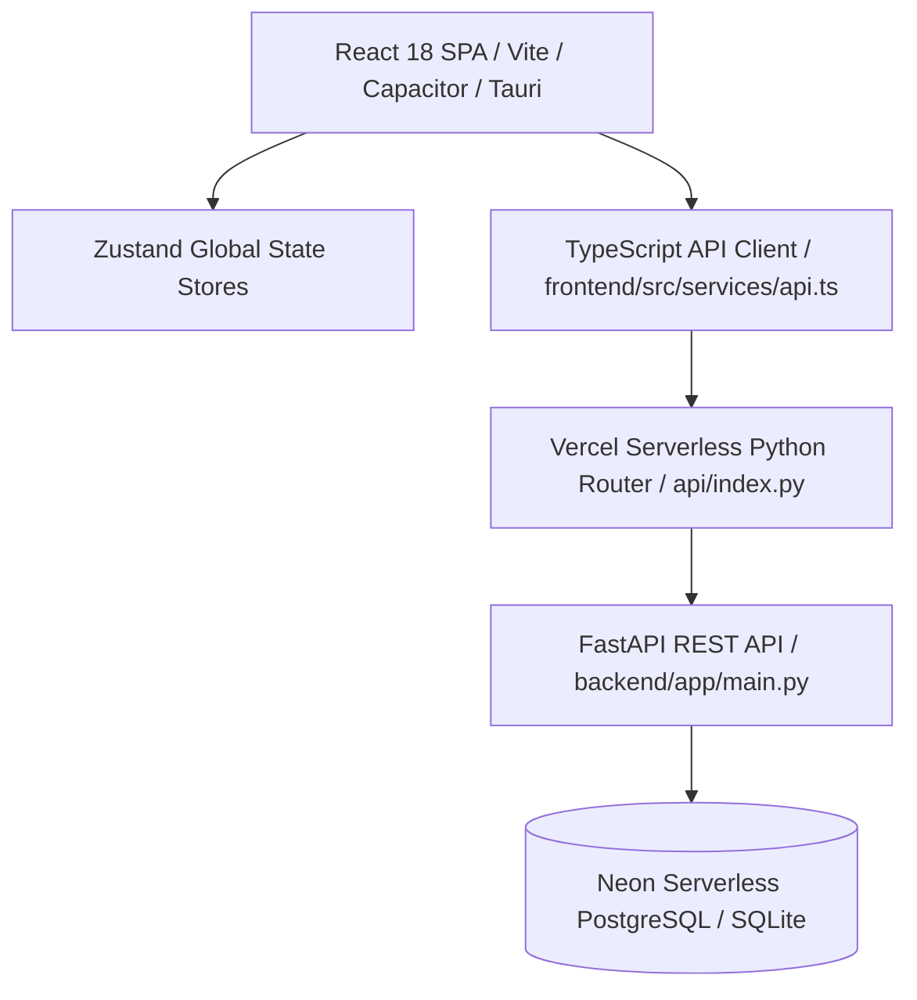
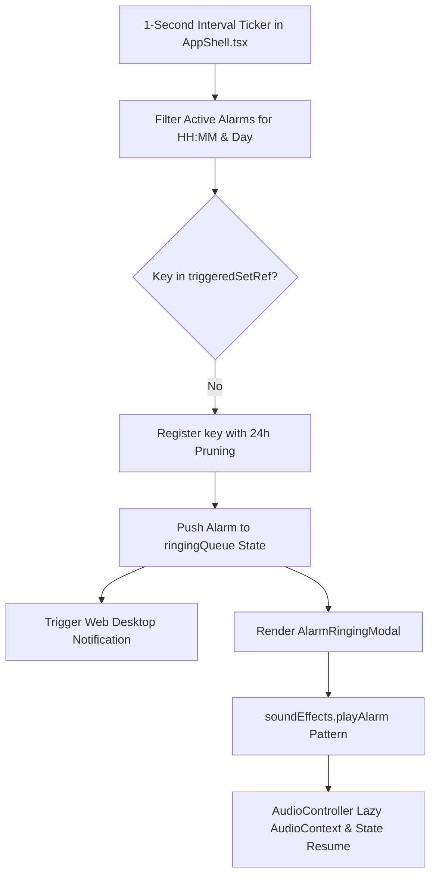

# PCC Application Architecture & Module Map (`ARCHITECTURE.md`)

This document provides a technical overview of the architecture, module layout, state management, and file organization for **Personal Control Center (PCC)**.

---

## 1. High-Level System Architecture



- **Frontend Framework**: React 18 with TypeScript & Vite 5.
- **Cross-Platform Targets**: Mobile Android APK (Capacitor v6) and Desktop App (Tauri v2).
- **Production Backend Deployment**: Vercel Serverless Python (`@vercel/python`) hosted at `https://pcc-backend-ten.vercel.app`.
- **Database Engine**: Neon Serverless PostgreSQL (`postgresql://...sslmode=require`) with SQLAlchemy 2.0 connection pool recycling (`pool_recycle=300`, `pool_pre_ping=True`) for cloud persistence, and SQLite 3 for offline development.
- **Routing**: React Router v6 (`createBrowserRouter`) with lazy-loaded route chunks and Suspense fallback `<PageLoader />`.
- **State Management**: Zustand lightweight stores with persist middleware and optimistic mutation queue (`syncQueue.ts`).
- **Data Fetching**: Custom fetch-based API engine (`apiClient`) supporting fallbacks, snake_case/camelCase payload normalization, and dynamic base URL overrides.
- **Layout Shell**: Responsive `AppShell` with desktop navigation drawer (`DesktopLayout`) and mobile bottom bar (`MobileLayout`).

---

## 2. Directory Layout

```
PCC_Personal-Control-Center/
├── AGENTS.md                 # Antigravity agent workflow & constraints
├── docs/                     # Project documentation (PRD, TRD, DESIGN, ARCHITECTURE, etc.)
├── frontend/
│   ├── index.html            # Main HTML entry
│   ├── package.json          # Dependencies & build scripts
│   └── src/
│       ├── app/              # App root component
│       ├── components/       # Global UI components (Button, Modal, Card, PageLoader, Spinner)
│       ├── features/         # Feature-sliced module domain folders
│       ├── hooks/            # Custom React hooks (useToast, etc.)
│       ├── layouts/          # AppShell, DesktopLayout, MobileLayout, NavConfig
│       ├── routes/           # Router definitions & Suspense fallbacks
│       ├── services/         # API client & mock services
│       ├── stores/           # Zustand global state stores
│       ├── styles/           # Design system tokens (index.css)
│       └── utils/            # Helper utilities (cn, date formatters)
├── backend/                  # FastAPI python backend
└── worker/                   # Async task runner
```

---

## 3. Active Module Reference

The active production modules in PCC include:

| Module Name | Route | Key Features | State Store |
| :--- | :--- | :--- | :--- |
| **Dashboard** | `/` | Daily Briefing summary, top metric cards, action list | Local state + API |
| **Tasks** | `/tasks` | Task lists, Kanban board, priority filtering | `taskStore` |
| **Projects** | `/projects` | Project tracking, milestone progression, Kanban | `projectStore` |
| **Calendar** | `/calendar` | Month/week grid, event creation, category filtering | `calendarStore` |
| **Goals** | `/goals` | OKR matrix, OKRProgressRing, milestone checkpoints | `goalStore` |
| **Notes** | `/notes` | Split-pane markdown workspace, live preview, auto-save | `noteStore` |
| **Ideas** | `/ideas` | Idea incubator, spark capture, project promotion | `ideaStore` |
| **Contacts** | `/contacts` | Personal CRM, interaction log, catch-up reminders | `contactStore` |
| **Reminders** | `/reminders` | Context-aware nudges, scheduled time alerts | `reminderStore` |
| **Alarms** | `/alarms` | Digital clock hero, alarm schedules, toggle switches | `alarmStore` |
| **Timers** | `/timers` | Pomodoro, Stopwatch, custom countdowns | `timerStore` |
| **Weather** | `/weather` | Pune, IN telemetry, 5-day forecast, unit toggle | `weatherStore` |
| **Settings** | `/settings` | Integrations, JSON Onboarding & Export (`pcc_data.json`) | `uiStore` |
| **Global Search**| `/search` | Ctrl+K Fuzzy command palette & full-text index | Global UI |

---

## 4. Deprecated / Removed Modules

As specified in `AGENTS.md`, the following legacy modules have been officially deprecated and removed:
- *Life Management*
- *Periodic Reviews*
- *World Clocks Planner*
- *Career & Growth*

Do **not** re-introduce these deprecated modules.

---

## 5. Build & Production Verification

- **Production Build Command**: `npm run build` (Runs `tsc && vite build`).
- **Development Server**: `npm run dev`

---

## 6. Core Platform Service Architecture

### 6.1 Alarm Scheduler Engine (`alarmScheduler.ts`)
The `alarmScheduler` service provides cross-platform alarm and reminder scheduling, bridging native OS notification APIs (Capacitor `@capacitor/local-notifications`) and browser Web Notifications.

```mermaid
graph TD
    AlarmStore[useAlarmStore / useReminderStore] --> AlarmScheduler[alarmScheduler.ts]
    AlarmScheduler --> PlatformCheck{Capacitor.isNativePlatform()?}
    PlatformCheck -- Yes (Mobile) --> FNV[FNV-1a Numeric Hash ID Generation]
    FNV --> LocalChannel[Create pcc_alarms_channel: Max Importance 5]
    LocalChannel --> NativeSchedule[LocalNotifications.schedule with allowWhileIdle: true]
    PlatformCheck -- No (Web/Desktop) --> WebNotification[Web Notification API / requireInteraction]
```

- **Native Channel Initialization**: Creates high-priority notification channel `pcc_alarms_channel` with MAX importance (level 5), public lockscreen visibility (`visibility: 1`), custom vibration pattern, and `alarm.wav` sound.
- **FNV-1a Hashing Identifier**: Native notification APIs require 32-bit integer IDs. The service converts string UUIDs (e.g. `alm_12345` or `rmd_67890`) into deterministic positive numbers using `fnv1aHash`:
  - Alarms namespace offset: `100000000 + (hash % 100000000)`
  - Reminders namespace offset: `200000000 + (hash % 100000000)`
- **Day Recurrence Calculation**: Computes the exact target `Date` for the next alarm trigger by parsing `alarm.time` (`HH:MM`) and evaluating the `alarm.days` array offset relative to the current local day-of-week.
- **OS Low-Power Doze Mode Wakeup**: Configures `schedule: { at: targetDate, allowWhileIdle: true }` to ensure native alarms trigger even when the mobile OS is in low-power idle doze mode.

---

### 6.2 System Permission Service (`permissionService.ts`)
The `permissionService` handles system permission detection, queries, and requests for notifications and geolocation across native mobile apps (Capacitor) and web browser environments.

```mermaid
graph TD
    App[App Init / Settings UI] --> PermService[permissionService.ts]
    PermService --> CheckPerms[checkPermissions()]
    CheckPerms --> RetStatus[Returns SystemPermissionStatus]
    PermService --> ReqAll[requestAllPermissions()]
    ReqAll --> ReqNotif[requestNotificationPermission()]
    ReqAll --> ReqLoc[requestLocationPermission with 3000ms Timeout Safeguard]
```

- **Unified Permission Model (`SystemPermissionStatus`)**:
  - `notifications`: `'granted' | 'denied' | 'prompt' | 'unsupported'`
  - `location`: `'granted' | 'denied' | 'prompt' | 'unsupported'`
- **Cross-Platform Inspection**:
  - *Native Platform*: Invokes `LocalNotifications.checkPermissions()` and `Geolocation.checkPermissions()`.
  - *Web Platform*: Inspects `Notification.permission` and queries `navigator.permissions.query({ name: 'geolocation' })`.
- **Geolocation Timeout Safeguard**: On web browsers, permission prompts for geolocation can remain pending indefinitely if ignored by the user. `requestLocationPermission()` wraps `navigator.geolocation.getCurrentPosition` with an explicit **3000ms race-condition timeout safeguard** to prevent application execution or UI components from hanging:
  ```typescript
  const timer = setTimeout(() => {
    if (!finished) {
      finished = true;
      resolve(false);
    }
  }, 3000);
  ```
- **Batch Non-Blocking Requester (`requestAllPermissions()`)**: Uses `Promise.allSettled` to request both notification and location permissions concurrently without throwing unhandled promise rejections.

---

### 6.3 Mobile-Desktop Cross-Device Auto-Sync (`useAutoSync.ts`)
The `useAutoSync` custom hook orchestrates real-time state synchronization across devices, keeping local Zustand state stores synchronized with the backend REST API endpoints (`/api/v1/*`).

```mermaid
graph TD
    AppShell[AppShell.tsx Mount] --> AutoSync[useAutoSync Hook]
    AutoSync --> Trigger1[1. Initial Component Mount]
    AutoSync --> Trigger2[2. Window visibilitychange Listener]
    AutoSync --> Trigger3[3. Capacitor appStateChange Listener]
    AutoSync --> Trigger4[4. 60s Periodic Background Heartbeat]
    Trigger1 & Trigger2 & Trigger3 & Trigger4 --> SyncAll[syncAll() Execution]
    SyncAll --> AllSettled[Promise.allSettled across 7 Domain Stores]
    AllSettled --> FetchDomain[fetchAlarms, fetchReminders, fetchTasks, fetchNotes, fetchProjects, fetchEvents, fetchIdeas]
```

- **Top-Level Mounting**: Mounted at the top level of `AppShell.tsx` so state synchronization runs continuously regardless of the active route or view.
- **7-Store Concurrent Synchronization**: Fetches fresh remote data using `Promise.allSettled` across `alarmStore`, `reminderStore`, `taskStore`, `noteStore`, `projectStore`, `calendarStore`, and `ideaStore`.
- **4-Part Lifecycle Trigger Matrix**:
  1. *Mount Initialization*: Triggers an immediate `syncAll()` when the application loads.
  2. *Browser Visibility Toggle*: Listens to window `visibilitychange` events and executes `syncAll()` whenever `document.visibilityState === 'visible'`.
  3. *Native Mobile Foreground Resume*: Listens to Capacitor `App.addListener('appStateChange')` events and executes `syncAll()` when `state.isActive` transitions to true.
  4. *Periodic Background Polling*: Sets a 60-second `setInterval` heartbeat that polls backend API endpoints when the app is online and visible.
- **Resource & Memory Protection**: Cleans up window event listeners, Capacitor native handlers, and interval timers upon component unmount.

---

### 6.4 Ringing Alarm Queue & Audio Context Controls (`AppShell.tsx`, `audio.ts`, `AlarmRingingModal.tsx`)
The alarm ringing subsystem provides precise real-time alarm detection, queue management, and Web Audio API tone synthesis.



- **1-Second Real-Time Ticker Engine**: An interval in `AppShell.tsx` runs every 1000ms checking active alarms in `useAlarmStore`.
- **Deduplication Ref Map (`triggeredSetRef`)**: Tracks triggered alarm keys formatted as `${alarmId}-${dateStr}-${timeStr}`. Automatically prunes keys older than 24 hours (86,400,000 ms) to manage memory cleanly.
- **Sequential Ringing Queue (`ringingQueue`)**: Stores matching triggered alarms in a FIFO array state. Renders the active front alarm via `AlarmRingingModal.tsx`.
- **Web Audio API Synthesizer (`AudioController` in `utils/audio.ts`)**:
  - Lazily instantiates `AudioContext` on demand.
  - Automatically handles browser autoplay policies by calling `ctx.resume()` when `ctx.state === 'suspended'`.
  - Synthesizes audio using native Web Audio API oscillators (sine, square, triangle) and linear/exponential Gain node envelopes:
    - `radiant`: Bright multi-sine chord sequence (`587.33Hz`, `739.99Hz`, `880.0Hz`, `1174.66Hz`).
    - `digital`: Crisp triple square wave pulse train (`880Hz`).
    - `gentle`: Smooth sine wave sweep (`440Hz` -> `659.25Hz`).
    - Additional chime, timer complete, and click pip sound effects.

---

### 6.5 JSON Onboarding & Backup Engine (`jsonImportService.ts`)
`jsonImportService.ts` provides complete JSON schema validation, cleaning, backup export, and onboarding data restoration across all 12 PCC data domains.

- **Schema Validation & Cleaning (`validateAndCleanImportData`)**:
  - Parses raw JSON strings or objects.
  - Inspects and sanitizes objects for `user`, `tasks`, `projects`, `notes`, `ideas`, `calendarEvents`, `goals`, `contacts`, `reminders`, `alarms`, `integrations`, `weather`, and `finances`.
  - Accumulates detailed `ImportValidationIssue` reports (`level: 'error' | 'warning'`).
  - Generates fallback IDs, missing titles, default priorities, and normalized timestamps.
- **Batch Execution & State Re-Hydration (`executeDataImport`)**:
  - Writes validated domain payloads to corresponding `localStorage` keys (`pcc_tasks`, `pcc_projects`, `pcc_notes_store_v1`, `pcc_alarms_store_v1`, `pcc_alarms`, `pcc_integrations_store_v2`, etc.).
  - Dispatches custom DOM event `window.dispatchEvent(new Event('pcc-data-imported'))`.
  - Triggers asynchronous re-fetch methods across all active Zustand stores (`fetchAlarms()`, `fetchTasks()`, `fetchNotes()`, etc.).

