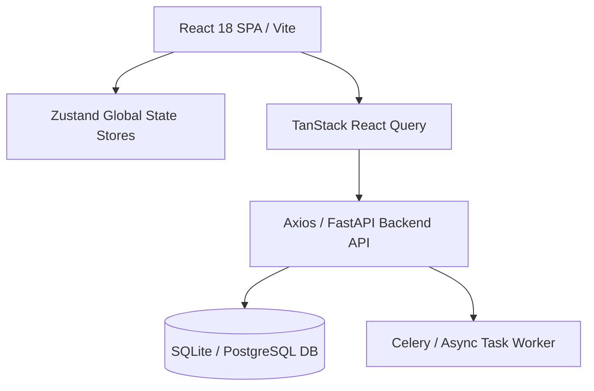

# PCC Application Architecture & Module Map (`ARCHITECTURE.md`)

This document provides a technical overview of the architecture, module layout, state management, and file organization for **Personal Control Center (PCC)**.

---

## 1. High-Level System Architecture



- **Frontend Framework**: React 18 with TypeScript & Vite 5.
- **Routing**: React Router v6 (`createBrowserRouter`) with lazy-loaded route chunks and Suspense fallback `<PageLoader />`.
- **State Management**: Zustand lightweight stores with persist middleware.
- **Data Fetching**: Axios API client (`apiClient`) with React Query hooks.
- **Layout Shell**: Responsive `AppShell` with desktop navigation drawer (`DesktopLayout`) and mobile bottom bar (`MobileLayout`).

---

## 2. Directory Layout

```
PCC_Personal-Control-Center/
├── AGENTS.md                 # Antigravity agent workflow & constraints
├── docs/                     # Project documentation (PRD, TRD, DESIGN, ARCHITECTURE, etc.)
├── frontend/
│   ├── index.html            # Main HTML entry
│   ├── package.json          # Dependencies & build scripts
│   └── src/
│       ├── app/              # App root component
│       ├── components/       # Global UI components (Button, Modal, Card, PageLoader, Spinner)
│       ├── features/         # Feature-sliced module domain folders
│       ├── hooks/            # Custom React hooks (useToast, etc.)
│       ├── layouts/          # AppShell, DesktopLayout, MobileLayout, NavConfig
│       ├── routes/           # Router definitions & Suspense fallbacks
│       ├── services/         # API client & mock services
│       ├── stores/           # Zustand global state stores
│       ├── styles/           # Design system tokens (index.css)
│       └── utils/            # Helper utilities (cn, date formatters)
├── backend/                  # FastAPI python backend
└── worker/                   # Async task runner
```

---

## 3. Active Module Reference

The active production modules in PCC include:

| Module Name | Route | Key Features | State Store |
| :--- | :--- | :--- | :--- |
| **Dashboard** | `/` | Daily Briefing summary, top metric cards, action list | Local state + API |
| **Tasks** | `/tasks` | Task lists, Kanban board, priority filtering | `taskStore` |
| **Projects** | `/projects` | Project tracking, milestone progression, Kanban | `projectStore` |
| **Calendar** | `/calendar` | Month/week grid, event creation, category filtering | `calendarStore` |
| **Goals** | `/goals` | OKR matrix, OKRProgressRing, milestone checkpoints | `goalStore` |
| **Notes** | `/notes` | Split-pane markdown workspace, live preview, auto-save | `noteStore` |
| **Ideas** | `/ideas` | Idea incubator, spark capture, project promotion | `ideaStore` |
| **Contacts** | `/contacts` | Personal CRM, interaction log, catch-up reminders | `contactStore` |
| **Reminders** | `/reminders` | Context-aware nudges, scheduled time alerts | `reminderStore` |
| **Alarms** | `/alarms` | Digital clock hero, alarm schedules, toggle switches | `alarmStore` |
| **Timers** | `/timers` | Pomodoro, Stopwatch, custom countdowns | `timerStore` |
| **Weather** | `/weather` | Pune, IN telemetry, 5-day forecast, unit toggle | `weatherStore` |
| **Settings** | `/settings` | Integrations, JSON Onboarding & Export (`pcc_data.json`) | `uiStore` |
| **Global Search**| `/search` | Ctrl+K Fuzzy command palette & full-text index | Global UI |

---

## 4. Deprecated / Removed Modules

As specified in `AGENTS.md`, the following legacy modules have been officially deprecated and removed:
- *Life Management*
- *Periodic Reviews*
- *World Clocks Planner*
- *Career & Growth*

Do **not** re-introduce these deprecated modules.

---

## 5. Build & Production Verification

- **Production Build Command**: `npm run build` (Runs `tsc && vite build`).
- **Development Server**: `npm run dev`
